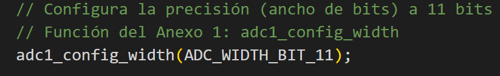

# Solución Examen Microprocesadores - Prueba 2 (2024-25)

Esta solución contiene las respuestas al examen y secciones adicionales ("Notas de Estudio") para profundizar en los conceptos.

---

## EJERCICIO 1: ADC (1 Punto)

### Apartado 1.1) Configuración ADC1

**Respuesta:**
```c
// Configura la precisión (ancho de bits) a 11 bits
// Función del Anexo 1: adc1_config_width
adc1_config_width(ADC_WIDTH_BIT_11);

// Configura la atenuación del canal 7 (GPIO35)
// Para leer 3.3V (voltaje máx), se necesita atenuación de 11dB
// Función del Anexo 1: adc1_config_channel_atten
adc1_config_channel_atten(ADC1_CHANNEL_7, ADC_ATTEN_DB_11);

// Declara y lee la variable (lectura "raw" o cruda)
int adc_valor = adc1_get_raw(ADC1_CHANNEL_7);


```

### Apartado 1.2) Cálculo Valor Digital

**Respuesta:**

1.  **Datos:**
    *   Voltaje de entrada ($V_{in}$) = 1.8 V
    *   Voltaje de referencia máximo ($V_{ref}$) = 3.3 V (debido a la atenuación de 11dB)
    *   Resolución = 11 bits $\rightarrow 2^{11} - 1 = 2047$ (valor máximo digital)

2.  **Cálculo:**
    $$ Valor_{Digital} = \frac{V_{in}}{V_{ref}} \times Valor_{Max} $$
    $$ Valor_{Digital} = \frac{1.8}{3.3} \times 2047 $$
    $$ Valor_{Digital} \approx 0.5454 \times 2047 \approx 1116.5 $$

3.  **Resultado:** `1116` (o `1117`)

---

## EJERCICIO 2: Timer (2 Puntos)

### Apartado 2.1) Cálculo Valarm

**Respuesta:**

1.  **Calcular frecuencia del timer ($f_{timer}$):**
    $$ f_{timer} = \frac{f_{clk}}{P} = \frac{80 \text{ MHz}}{80} = 1 \text{ MHz} $$
    Esto significa que el timer cuenta 1,000,000 de veces por segundo (cada $1 \mu s$).

2.  **Calcular cuentas necesarias para 15 ms:**
    $$ 15 \text{ ms} = 15000 \mu s $$
    $$ V_{alarm} = \frac{15000 \mu s}{1 \mu s/tick} = 15000 $$

**Resultado:** $V_{alarm} = 15000$

### Apartado 2.2) Función de configuración

**Respuesta:**

```c
static void fcn_timer3_init()
{
    /*Declarar estructura conf de tipo timer_config_t y sus datos públicos conf.xxx*/
    timer_config_t conf;
    conf.alarm_en = TIMER_ALARM_EN;      // Habilitar alarma
    conf.counter_en = TIMER_PAUSE;       // Pausado durante configuración
    conf.intr_type = TIMER_INTR_LEVEL;   // Interrupción por nivel
    conf.counter_dir = TIMER_COUNT_UP;   // Contar hacia arriba (0 a Valarm)
    conf.auto_reload = TIMER_AUTORELOAD_EN; // Auto-recarga para ser periódico
    conf.divider = 80;                   // Divisor calculado previamente

    /*Inicializar y Configurar el timer3*/
    // Timer 3 corresponde al Grupo 1, Timer 1 (Timer 0 y 1 son G0; Timer 2 y 3 son G1)
    timer_init(TIMER_GROUP_1, TIMER_1, &conf);

    /*Parar el Contador del Timer*/
    timer_pause(TIMER_GROUP_1, TIMER_1);

    /*Cargar el valor inicial de la cuenta */
    timer_set_counter_value(TIMER_GROUP_1, TIMER_1, 0);

    /*Fijar el valor de la alarma*/
    timer_set_alarm_value(TIMER_GROUP_1, TIMER_1, 15000); // 15 ms

    /*Habilitar la interrupción del Timer*/
    timer_enable_intr(TIMER_GROUP_1, TIMER_1);

    /*Registrar el manejador de la interrupción ISR_Timer3*/
    // Se usa 0 o ESP_INTR_FLAG_IRAM en los flags
    timer_isr_register(TIMER_GROUP_1, TIMER_1, ISR_Timer3, NULL, 0, NULL);

    /*Iniciar el Contador del timer*/
    timer_start(TIMER_GROUP_1, TIMER_1);
}
```

**Nota de Estudio:**
*   Es importante identificar qué "Timer" físico (Group/Index) corresponde al "Timer 3" lógico. Normalmente: G0_T0, G0_T1, G1_T0, G1_T1.

---

## EJERCICIO 3: UART (1.5 Puntos)

### Apartado 3.1) Configuración Serial

**Respuesta:**
```cpp
// 9600 baudios, 8 bits datos, Paridad Par (Even), 2 bits Stop
// Constante Anexo 3: SERIAL_8E2
Serial.begin(9600, SERIAL_8E2);
```

### Apartado 3.2) Trama UART

**Respuesta:**
La trama configurada (8E2) tiene **12 bits** en total:

```text
  [START] [D0][D1][D2][D3][D4][D5][D6][D7] [PARIDAD] [STOP][STOP]
    0      x   x   x   x   x   x   x   x       P       1     1
```

*   **Start Bit (0):** Bit bajo que sincroniza el inicio de la transmisión.
*   **8 Bits de Datos:** La información útil (D0 a D7).
*   **Bit de Paridad (P):** Paridad Par. Se pone a 0 o 1 para que el número total de unos (datos + paridad) sea par. Sirve para detección de errores.
*   **2 Bits de Stop (1):** Bits altos que indican el fin del carácter y garantizan un tiempo de espera antes del siguiente.

### Apartado 3.3) Throughput

**Respuesta:**
*   **Bits transmitidos por segundo (Raw Throughput):** Es equivalente a la velocidad en baudios: **9600 bps**.
*   **Análisis detallado (por si se requiere):** Se envían 12 bits por cada byte de información (overhead del 33%).

---

## EJERCICIO 4: I2C (0.5 Puntos)

**Respuesta:**
Esquema de **Lectura** I2C:

1.  **S (Start):** Inicio de comunicación. Puesto por el **MAESTRO**.
2.  **SLAVE ADDRESS:** Dirección del dispositivo. Puesto por el **MAESTRO**.
3.  **R/W:** Bit de control (1 para Read). Puesto por el **MAESTRO**.
4.  **A (ACK):** Confirmación de dirección. Puesto por el **ESCLAVO**.
5.  **DATA:** Byte de datos leído. Puesto por el **ESCLAVO**.
6.  **A (ACK):** Confirmación de recepción. Puesto por el **MAESTRO**.
7.  **DATA:** Siguiente byte... Puesto por el **ESCLAVO**.
8.  **Ā (NACK):** "No Acknowledge" para indicar fin de lectura. Puesto por el **MAESTRO**.
9.  **P (Stop):** Fin de comunicación. Puesto por el **MAESTRO**.

---

## EJERCICIO 5: I2C Código (1.5 Puntos)

### Apartado 5.1) Definiciones

**Respuesta:**
```cpp
/*Define las direcciones del registro y del dispositivo*/
// La dirección 0xA3 suele ser la de 8 bits (Lectura). La dirección de 7 bits es 0xA3 >> 1 = 0x51.
// Arduino Wire usa direcciones de 7 bits.
#define ADDR_DEVICE 0x51
#define ADDR_REG    0x66

/*Declara la función read_2bytes*/
uint16_t read_2bytes();
```

### Apartado 5.2) Implementación

**Respuesta:**
```cpp
uint16_t read_2bytes() {
    uint16_t dato_leido = 0;

    // 1. Apuntar al registro que queremos leer (Escritura de dirección)
    Wire.beginTransmission(ADDR_DEVICE);
    Wire.write(ADDR_REG);
    Wire.endTransmission(false); // 'false' envía RESTART, manteniendo el bus activo

    // 2. Solicitar 2 bytes al dispositivo
    Wire.requestFrom(ADDR_DEVICE, 2);

    // 3. Leer y reconstruir (asumiendo MSB primero)
    if (Wire.available() >= 2) {
        uint8_t msb = Wire.read();
        uint8_t lsb = Wire.read();
        dato_leido = (msb << 8) | lsb;
    }
    
    return dato_leido;
}
```

**Nota de Estudio:** El uso de `endTransmission(false)` es crítico en lecturas de registros (Repeated Start) para que otro maestro no tome el bus entre la escritura de la dirección del registro y la lectura de los datos.

---

## EJERCICIO 6: FreeRTOS (3.5 Puntos)

### Apartado 6.1) Creación de Tareas
**Respuesta:**
```c
// Dentro de setup()
xTaskCreate(vTaskLeeSensor, "LeeSensor", 4096, NULL, 4, NULL);
xTaskCreate(vTaskCalculaMedia, "CalculaMedia", 4096, NULL, 4, NULL);
```

### Apartado 6.2) Semáforo
**Respuesta:**
```c
// Variable global
SemaphoreHandle_t semaforo_binario;

// En setup()
semaforo_binario = xSemaphoreCreateBinary();
```

### Apartado 6.3) Cola
**Respuesta:**
```c
// Variable global
QueueHandle_t cola_sensor;

// En setup()
cola_sensor = xQueueCreate(100, sizeof(type_data_sensor));
```

### Apartado 6.4) vTaskLeeSensor
**Respuesta:**
```c
void vTaskLeeSensor(void *pvParameters) {
    type_data_sensor datos;
    while(1) {
        /*Leer los datos de temperatura y humedad del sensor*/
        datos = f_obtener_valores_del_sensor();

        printf("vTaskLeeSensor: %.2f\n", datos.data_hum);
        printf("vTaskLeeSensor: %.2f\n", datos.data_temp);
        printf("\n"); 

        /*Enviar datos a la cola*/
        // Se envía a la cola 'cola_sensor'.
        // Se usa portMAX_DELAY para esperar si está llena, o 0 para no bloquear.
        // Dado que es una lectura periódica, portMAX_DELAY asegura entrega.
        xQueueSend(cola_sensor, &datos, portMAX_DELAY);

        /* Bloquear tarea durante 10 min*/
        // 10 minutos * 60 seg/min * 1000 ms/seg
        vTaskDelay(pdMS_TO_TICKS(10 * 60 * 1000));
    }
}
```

### Apartado 6.5) vTaskCalculaMedia
**Respuesta:**
```c
void vTaskCalculaMedia(void *pvParameters) {
    // Array para almacenar todos los datos de la cola antes de calcular
    type_data_sensor datos[TAM_MAX_COLA]; 
    UBaseType_t elementos;
    type_output_result resultado;

    while(1) {
        /* Espera a recibir el semáforo binario */
        xSemaphoreTake(semaforo_binario, portMAX_DELAY);

        /* Obtener el número de elementos en la cola */
        elementos = uxQueueMessagesWaiting(cola_sensor);

        // Validar no desbordar el array (buena práctica)
        if (elementos > TAM_MAX_COLA) elementos = TAM_MAX_COLA;

        for (UBaseType_t i = 0; i < elementos; i++) {
            /*Leer datos de la cola*/
            xQueueReceive(cola_sensor, &datos[i], portMAX_DELAY);
        }

        /*Calcular la media*/
        // Pasamos el array 'datos' (que decae a puntero) y la cantidad
        // Nota: Asumimos que f_calcula_media acepta un puntero o array aunque
        // el prototipo del enunciado diga 'type_data_sensor data' (singular).
        resultado = f_calcula_media(*datos, elementos); 

        // Imprimir los resultados en la consola serie 
        printf("Media de Humedad: %.2f\n", resultado.avg_hum);
        printf("Media de Temperatura: %.2f\n", resultado.avg_temp);
    }
}
```

### Apartado 6.6) Configuración Interrupción (Pin 39)
**Respuesta:**
```cpp
// Configurar pin como entrada (con pullup interno si el botón cierra a tierra)
pinMode(39, INPUT_PULLUP);
// Asociar interrupción al flanco de bajada (FALLING)
attachInterrupt(digitalPinToInterrupt(39), ISR_EXT, FALLING);
```

### Apartado 6.7) Rutina ISR_EXT
**Respuesta:**
```c
// IRAM_ATTR es necesario para ISRs en ESP32
void IRAM_ATTR ISR_EXT() {
    BaseType_t xHigherPriorityTaskWoken = pdFALSE;
    
    // Entregar el semáforo desde la ISR
    xSemaphoreGiveFromISR(semaforo_binario, &xHigherPriorityTaskWoken);
    
    // Solicitar cambio de contexto si se despertó una tarea de mayor prioridad
    if (xHigherPriorityTaskWoken == pdTRUE) {
        portYIELD_FROM_ISR();
    }
}
```

### Apartado 6.8) Pregunta Teórica
**Respuesta:**
Si el operario no pulsa el botón durante toda la noche:
1.  La tarea `vTaskCalculaMedia` nunca se desbloquea, por lo que no consume datos de la cola.
2.  La tarea `vTaskLeeSensor` sigue llenando la cola cada 10 minutos.
3.  Al tener la cola un tamaño de 100, se llenará tras $100 \times 10 = 1000$ minutos (aprox 16.6 horas).
4.  **Consecuencia:** Una vez llena, si `vTaskLeeSensor` usa `portMAX_DELAY` en `xQueueSend`, la tarea lectora se **bloqueará indefinidamente** esperando espacio libre, deteniendo la toma de datos. Si usa timeout 0, los **datos nuevos se perderán**.

```